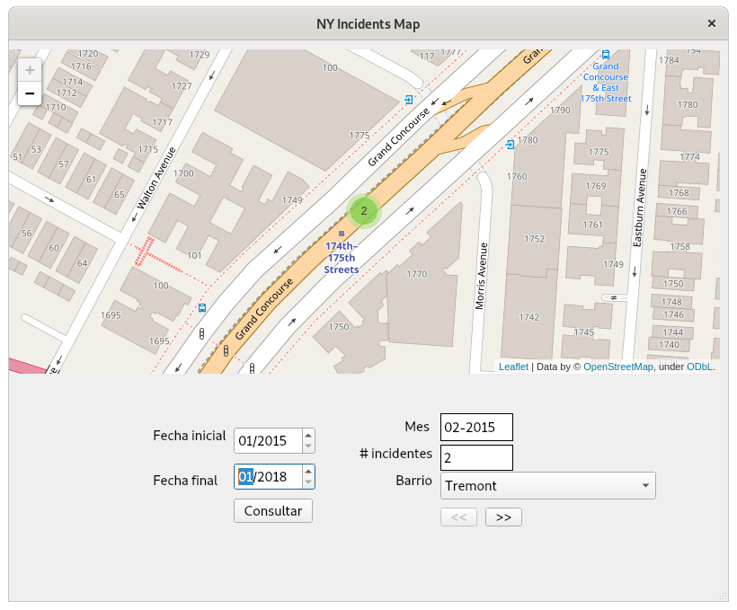

# Proyecto PostGIS

## Enunciado

### Objetivo

Llevar  a  la  práctica  los  conocimientos  adquiridos  durante  eldesarrollo  de  la  asignatura,  en  la  parte correspondiente a las bases de datos espaciales.

Como  objetivo  de  este  proyecto,se mostrarán gráficamente sobre un mapa una  serie  de  puntos relativos a la localización de unos “incidentes”.

### Pasos previos

- Se  partirá  de  un  fichero  de  texto que  contendrá líneas con los  siguientes  datos(separados con tabuladores): FECHA   LONGITUD   LATITUD.
- El formato de la fecha es AÑO-MES-DÍA.
- Dichos datos son la ubicación de incidentes en la ciudad de Nueva York.
- A  partir  de  dicho  fichero,  y  empleandolas  tablas cargadas  en PostGIS con  datos  de Nueva York,  se  obtendrá  otro  fichero de  texto en  el  que  cada  línea  tendrá  los  datos del  fichero anterior con el añadido del nombre del barrio donde se ubique cada incidente. Por ejemplo: `2015-01,-73.967,40.804,Upper West Side`. 

	La fecha en dicho fichero contendrá únicamente AÑO-MES, y los datos estarán separados por comas.•Dicho  fichero  resultante  será  la  fuente  de  datos  para una  aplicación  (escritorio,  web,  etc.) cuya funcionalidadse describe a continuación

## Preparación del conjunto de datos

### Fichero de datos inicial

El fichero de datos inicial, llamado `incidents.txt`, incluye un conjunto de datos representados de la siguiente forma:

	2020-06-11	-74.217	40.523
	2018-06-07	-74.009	40.706
	2018-07-09	-73.982	40.746
	2018-03-17	-73.982	40.613
	2019-05-06	-73.954	40.690
	2018-02-20	-74.178	40.541
	2019-12-08	-73.808	40.701
	2017-12-01	-73.996	40.744
	2017-09-17	-73.999	40.619

Las columnas del fichero son: Fecha del Incidente, Latitud, Longitud. Este fichero habrá que procesarlo para eliminar el día en la fecha del incidente, y añadir el nombre del barrio donde se produce el mismo

### Procesamiento del fichero de datos

Para el procesamiento del fichero de datos, nos crearemos un script en Python. En este script, recorreremos el fichero, y realizaremos consultas a PostGIS para obtener el barrio correspondiente a dicha latitud y longitud.

Para recorrer el fichero, utilizaremos la librería `numpy`, con la cual podremos almacenar el contenido del fichero en una matriz, y acceder a los datos utilizando las posiciones de sus filas y columnas. Para conectar con nuestra base de datos de PostGIS, utilizaremos las librería `psycopg2` y el módulo de la librería `postgis` para psycopg2 (`postgis.psycopg`). 

Para consultar el barrio al que pertenecen las coordenadas, convertiremos las coordenadas geográficas a geométricas, y utilizaremos la función `ST_contains()` comparándolas con la geometría del barrio. 

La consulta a realizar será esta:

	select name
	from nyc_neighborhoods
	where ST_contains(geom, ST_Transform(ST_GeomFromText({coordinates_str}, 4326), 26918))"

Finalmente, para el borrado del día del campo Fecha, reemplazaremos dicho campo por la subcadena sin los últimos 3 caracteres. 

El script se almacenará en el fichero `setup_file.py`.

#### Clases y métodos

Para mejorar la legibilidad y mantenibilidad, el script está dividido en varias clases.

- **PostGISQuery:** Clase encargada de la conexión y envío de las consultas a la base de datos
	+ `setup_pg_connection()`: Método encargado de establecer la conexión con la base de datos. Inicializa el atributo `cursor`, con el cursor de acceso a la base de datos
	+ `send_query(query_str: str)`: Ejecuta la consulta indicada en la cadena recibida por parámetro. Devuelve una matriz con los resultados de consulta.
	
- **CityQuery:** Clase encargada de preparar las consultas y recoger los resultados. Hace uso de la clase anterior para realizar la conexión a la base de datos y enviar la consulta ya preparada.
	+ `__init__(pg_query: PostGISQuery)`: Constructor. Recibe por parámetro un objeto de la clase PostGISQuery, e invoca a uno de sus métodos para establecer la conexión
	+ `search_neighborhood(coordinates_str)`: Recibe una cadena de texto con las coordenadas en formato `POINT(longitud, latitud)`, y prepara y envía la consulta a la base de datos. Devuelve el nombre del barrio al que pertenecen las coordenadas.  
	
- **ProcessFile**: Carga el fichero de datos y, haciendo uso de las clases anteriores, realiza su procesamiento
	+ `__init__(filename: str):`Constructor. Recibe por parámetro el nombre del fichero, y llama al método `load_file_data()` para cargar sus datos.
	+ `load_file_data()`: carga los datos del fichero en una matriz
	+ `def fill_incident_neighborhood()`: Recorre la matriz de datos, añadiendo un nuevo campo con el nombre del barrio donde se ha producido el incidente
	+ `remove_day_from_date()`: Recorre la matriz de datos, borrando el día del campo Fecha.
	+ `export_to_csv(output_file: str)`: Exporta los datos de la matriz a un fichero csv separado por punto y coma, con el nombre de fichero recibido por parámetro.
	
#### Ejecución del script

- **Instalación de dependencias**

	Para ejecutar el script, primero hemos de instalar las dependencias. Para ello, nos situamos en el directorio donde están los fuentes, y ejecutamos

		pip install -r requirements.txt
	
- **Configuración de los parámetros de conexión a la BBDD**

	Para que la conexión se establezca correctamente, tendremos que reemplazar los valores del fichero `settings.py` por los de nuestra base de datos.
	
		host = "localhost"
		database = "postgis_db"
		user = "postgis_user"
		password = "postgis_pwd"
            
- **Ejecución del script**

	Y ejecutamos el script desde Python con
	
		python3 setup_file.py

La ejecución durará varios minutos

### Resultados

Tras la ejecución del script, nos aparecerá en el directorio un nuevo fichero llamado `incidents.csv`, con esta estructura

	2020-06,-74.217,40.523,Prince's Bay
	2018-06,-74.009,40.706,Financial District
	2018-07,-73.982,40.746,Gramercy
	2018-03,-73.982,40.613,Bensonhurst
	2019-05,-73.954,40.690,Bedford-Stuyvesant
	2018-02,-74.178,40.541,Annandale
	2019-12,-73.808,40.701,Jamaica
	2017-12,-73.996,40.744,Chelsea
	2017-09,-73.999,40.619,Bensonhurst
	2018-07,-73.990,40.734,Greenwich Village
	2018-08,-73.982,40.763,Midtown
	

## Implementación de la aplicación

Una vez con el fichero de datos ya preparado, preparamos la aplicación. La aplicación consistirá en una interfaz gráfica de escritorio, sobre la que se cargará el mapa y los controles necesarios para poder modificar el barrio y las fechas inicial y final a representar.

- **FrontEnd**

	La interfaz gráfica se desarrollará en Qt 5, utilizando la librería PyQt5 de Python. Para la representación del mapa utilizaremos la librería Folium, que generará un mapa basado en OpenStreetMap, y mostrará unos marcadores en las coordenadas indicadas. 

- **BackEnd**

	Para filtrar los puntos que correspondan con el rango de fechas y barrio indicados, utilizaremos la librería pandas, que cargará los datos del fichero csv en forma de dataframe, y permitirá realizar consultas sobre los mismos comparando los valores de sus columnas
	
### Backend: Consulta de los datos

Para la consulta de los datos utilizaremos la clase QueryDF (implementada en el fichero `query_incidents.py`), que cargará los datos del fichero en un dataframe, y nos proveerá de varios métodos para realizar consultas por barrio y fecha. La clase se compone de los siguientes métodos:

- `__init__(filename: str = None, df: pd.DataFrame = None)`: Constructor. Recibe por parámetro el nombre del fichero o el dataframe desde el que queremos cargar los datos. En caso de recibir el nombre de un fichero, llamará al método `load_data()` para cargar sus datos.

- `load_data(filename: str)`: Carga los datos del fichero en un dataframe, utilizando como nombres de columnas "Date", "Longitude", "Latitude" y "Neighborhood". También convierte el campo "Date" en un campo de fecha, para facilitar su filtrado posterior.

- `get_neighborhood_list()`: Obtiene la lista de barrios del dataframe, ordenados alfabéticamente. Devuelve una lista con los nombres de los barrios.  

- `search_by_date_range(date_start: str, date_end: str)`: Obtiene la lista de incidentes producidos dentro de un intervalo de fechas dado. Recibe por parámetro dos cadenas de caracteres con las fechas de inicio y fin en formato "AAAA-MM".  Devuelve la fecha consultada en formato *datetime* y un dataframe con la lista de incidentes obtenida.  

- `search_by_date(date_str: str)`: Obtiene la lista de incidentes producidos en una fecha exacta. Recibe por parámetro una cadena de caracteres con la fecha a consultar en formato "AAAA-MM".  Devuelve la fecha consultada en formato *datetime* y un dataframe con la lista de incidentes obtenida.  

- `def search_by_neighborhood(nbh_name: str)`: Obtiene la lista de incidentes de un determinado barrio. Recibe por parámetro una cadena de caracteres con el nombre del barrio.  Devuelve la fecha consultada en formato *datetime* y un dataframe con la lista de incidentes obtenida.  

- `search_by_neighborhood_and_date_range(nbh_name: str, date_start: str, date_end: str)`: Obtiene la lista de incidentes de un barrio en un intervalo de fechas dado. Recibe por parámetro tres cadenas de caracteres con el nombre del barrio, la fecha de inicio y la fecha de fin.  Devuelve la fecha consultada en formato *datetime* y un dataframe con la lista de incidentes obtenida.  

### BackEnd: Generación del mapa

Para la generación del mapa utilizaremos las clases EditMap, QueryMap y MapIterator (implementadas en el fichero `create_map.py`). Dado que existe la posibilidad de que haya varios puntos en las mismas coordenadas, utilizaremos un MarkerCluster() para agruparlos, de tal forma que podamos ver el número de marcadores que están situados en la misma localización.

- **Clase EditMap:** La clase EditMap servirá para crear el mapa, añadir los marcadores, y exportarlo a un flujo de bytes. Esta se compone de los siguientes métodos:

	- `__init__(location: list)`: Constructor. Recibe por parámetro el par de coordenadas a tomar de referencia para la visualización del mapa. Genera un mapa vacío y centrado en dicha localización.
	
	-  `create_markercluster()`: Crea un cluster de marcadores, que servirá para agrupar conjuntos de marcadores. Esto permitirá mostrar todos los puntos, incluso cuando varios se ubiquen en las mismas coordenadas.   
	
	-  `add_marker_to_cluster(latitude: float, longitude: float)`: Añade un marcador al cluster actual. Recibe por parámetro la latitud y longitud de dicho punto.
	
	-  `add_marker_to_map(latitude: float, longitude: float)`: Añade un marcador al mapa, fuera del cluster. Recibe por parámetro la latitud y longitud de dicho punto.
	
	- `clean_map()`: Genera un nuevo mapa, borrando todos los marcadores anteriores.
	
	- `fit_map_zoom(pnt_min: pd.DataFrame, pnt_max: pd.DataFrame)`: Ajusta el zoom del mapa, en función de una localización mínima y máxima. Recibe por parámetro dos dataframe, con las coordenadas de los puntos mínimo y máximo.
	
	- `export_map(mapobj: io)`: Exporta el mapa a un flujo de bytes, convertible en un fichero. 

- **Clase QueryMap**: La clase QueryMap permite mostrar sobre el mapa el resultado de ciertos tipos de consultas. Se compone de los siguientes métodos:

	- `__init__(filename: str = None, df: pd.DataFrame = None)`: Constructor. Recibe por parámetro el nombre de un fichero, o un dataframe. Inicializa dos atributos con objetos de la clase QueryDF (para las consultas) y EditMap (para la representación sobre el mapa).  
	
	- `_calculate_min_point(point_list: pd.DataFrame)`: Calcula el menor de una lista de puntos. Recibe por parámetro un dataframe con la lista de puntos donde buscar. Devuelve un dataframe con el punto menor encontrado.
	
	- `_calculate_max_point(point_list: pd.DataFrame)`: Calcula el mayor de una lista de puntos. Recibe por parámetro un dataframe con la lista de puntos donde buscar. Devuelve un dataframe con el punto mayor encontrado.
	
	- `_show_points_in_map(point_list: pd.DataFrame)`: Método auxiliar. Representa una lista de puntos sobre el mapa. Recibe por parámetro un dataframe con la lista de puntos a representar.  
	
	- `show_marks_by_neighborhood(self, nb_name: str)`: Muestra los incidentes producidos en un determinado barrio, ordenados por fecha. Recibe el nombre del barrio a consultar. Devuelve un objeto MapIterator, que nos permitirá iterar sobre el mapa, actualizando los datos según cada día seleccionado.
	
	- `show_marks_by_date(date_str: str)`: Muestra los incidentes producidos en un día dado. Recibe por parámetro una cadena de caracteres con la fecha a consultar, en formato "AAAA-MM". Devuelve un mapa con los puntos representados, y el numero de incidentes registrados en el mismo.
	
	- `show_marks_by_neighborhood_and_date_range(nbh_name: str, date_start: str, date_end: str)`: Muestra los incidentes producidos en un barrio dado en un intervalo de fechas. Recibe por parámetro el nombre del barrio, la fecha inicial y la fecha final. Devuelve un objeto MapIterator, con el iterador para ir mostrando el mapa actualizado para cada dia registrado.
	
	- `show_map()`: Exporta el mapa a un flujo de bytes. Devuelve el flujo de bytes obtenido

- **Clase MapIterator**: Permite "iterar" sobre un mapa, mostrando los marcadores del incidente por cada día registrado. Se compone de los siguientes métodos.  

	+ `__init__(query_df: pd.DataFrame, date_list: list)`: Constructor. Recibe por parámetro el dataframe con los datos a representar. Inicializa los atributos necesarios.
	
	* `get_num_regs()`: Devuelve el número de registros que tiene el mapa.
	
	+ `show_reg()`: Método auxiliar. Genera un mapa con el registro de incidentes de la fecha actual. Devuelve el mapa obtenido, el numero de incidentes y la fecha.
	
	+ `show_next_reg()`: Genera un mapa con el siguiente registro disponible. Devuelve el mapa obtenido, el número de incidentes, la fecha, y un flag indicando si hemos llegado al final de la lista (por el lado derecho).
	
	+ `show_back_reg()`: Genera un mapa con el registro anterior al actual. Devuelve el mapa obtenido, el número de incidentes, la fecha, y un flag indicando si hemos llegado al final de la lista (por el lado izquierdo).
	
### FrontEnd: Interfaz gráfica

La interfaz gráfica se generará en las clases `Ui_MapWindow` y `MainWindow`. La primera clase generará la interfaz en sí, mientras que la segunda implementará las acciones. Debido a su complejidad y longitud, no detallaremos los métodos uno por uno.

La interfaz consistirá en un formulario de tipo *MainWindow*, sobre el que se mostrará el mapa en un widget de tipo *webEngineView*, que cargará los datos del flujo de bytes, interpretándolos como un fichero HTML. 

Los campos con las fechas inicial y final serán widgets de tipo *QDateEdit*, y no admitirán fechas anteriores a Enero de 2015 (la fecha mas antigua registrada en el fichero).

El menú desplegable, para la selección del barrio a mostrar, será un widget de tipo *ComboBox*, que cargará sus datos mediante una llamada al método `get_neighborhood_list()`de la clase QueryDF.

Los botones consistirán en widgets PushButton. En el caso de los botones de desplazamiento para avanzar o retroceder, estos estarán conectados a los métodos `show_back_reg()` y `show_next_reg()` y se desactivarán al llegar al final de la lista por su respectivo lateral (para ello, utilizarán el flag devuelto por dichos métodos). El botón de consultar invocará al método  `show_marks_by_neighborhood_and_date_range()` de la clase QueryMap.

La interfaz quedará así:

## Ejecución de la aplicación

### Arranque de la aplicación

- **Instalación de dependencias**

	Si no instalamos las dependencias anteriormente, las instalamos con
	
		pip install -r requirements.txt
		
- **Ejecución de la aplicación**

	Para ejecutar la aplicación, simplemente tenemos que ejecutar el script `map_window.py` desde Python 3
	
		python3 map_window.py
	
	Se nos abrirá una ventana como esta:
	
	

### Funcionamiento de la aplicación

Una vez abierta la aplicación, utilizamos los controles para seleccionar barrio, fecha inicial y fecha final

- **Selección de barrio**

	Para seleccionar el barrio, pulsamos sobre el menú desplegable, y seleccionamos el barrio de nuestro interés dentro de la lista
	
	
	
- **Selección de fechas**

	Para seleccionar la fecha, cambiamos los valores de los cuadros "Fecha Inicial" y "Fecha Final"

	
	
- **Inicio de la consulta**

	Pulsamos el botón "Consultar" para iniciar la consulta
	
	
	
	Se nos mostrará el primer registro localizado en ese rango de fechas, con los marcadores situados en las posiciones donde se han producido los incidentes. El campo "Mes" se rellenará con el mes donde se ha producido dicho registro, y el campo "# incidentes" mostrará el número de incidentes encontrados para dicho mes.
	
- **Visualización de múltiples marcadores sobre el mismo punto**
	
	En caso de que haya mas de un marcador sobre las mismas coordenadas, se nos mostrarán los puntos agrupados en un círculo, indicando el número de incidentes que hay en dicha zona.
	
	
	
	Si pulsamos sobre el círculo, se nos mostrarán los marcadores de forma individual
	
	
	
- **Avance y retroceso de registros**

	Pulsando los botones de "<<" y ">>", podemos avanzar y retroceder en los diferentes días registrados en nuestro conjunto de resultados. El zoom y la posición del mapa se reajustará a la posición del mapa donde se sitúen los marcadores.
	
	
	
	
	
	Al llegar al último registro del mapa, el botón ">>" se desactivará
	
	
	
	De igual forma, al situarnos en el primer registro del mapa, el botón "<<" se desactivará.
	
	
	
	Los campos "Mes" y "# incidentes" se irán actualizando con los datos del registro actual.
	
- **Consulta sin resultados**

	Si realizamos una consulta que no ha obtenido ningún resultado, el mapa se situará en su posición inicial, el campo "Mes" se vaciará, y el "# incidentes" se pondrá a 0.
	
	
	
- **Consulta con un único resultado**

	En caso de que la consulta devuelva un único resultado, el registro obtenido se mostrará sobre el mapa, pero los botones de avanzar y retroceder se mostrarán desactivados.
	
	